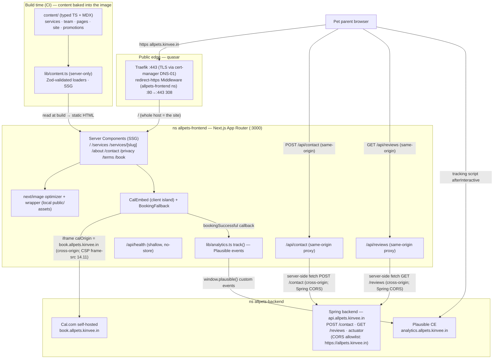

# allpets — Frontend Low-Level Design (LLD)

> **File owner:** 19.3 (the Frontend LLD named in the HLD's §0 and §14). · **Area:** `area:docs` · **Repo:** `allpets-frontend`.
>
> **Status:** **Revised 2026-06-17 for the Spring-backend pivot (supersedes the Payload-centric baseline).** This is the component-level design the marketing-site epics build to: **Epic 7** (site shell), **Epic 8** (public pages), **Epic 9** (booking integration), with the cross-cutting SEO/a11y/perf pass cited at design level from **Epic 12**.
>
> **Relationship to the spine.** This LLD is subordinate to the **System HLD** — [`allpets-backend/planning/architecture.md`](../../allpets-backend/planning/architecture.md) (19.1, **revised 2026-06-17 for the pivot**). The HLD is the conceptual spine (topology, namespaces, NetworkPolicies, DNS/TLS, secrets, CI/CD, co-tenancy). **This document does not re-derive those decisions — it cites them by section topic and designs the frontend within their constraints.** Where this doc and an older spec disagree, the HLD's **2026-06-17 pivot** + 2026-06-15 owner decisions + cluster verification win.
>
> **Companion docs:** [Backend LLD (19.2)](../../allpets-backend/planning/lld-backend.md) · ingress pattern [`allpets-backend/deploy/k8s/ingress/README.md`](../../allpets-backend/deploy/k8s/ingress/README.md) (HLD *Ingress pattern*) · epic specs [`epic-07`](../../planning/issues/epic-07-marketing-site-shell.md) / [`epic-08`](../../planning/issues/epic-08-public-pages.md) / [`epic-09`](../../planning/issues/epic-09-booking-integration.md).
>
> **The 2026-06-17 pivot in one paragraph (frontend lens):** Payload CMS is **gone** — there is no CMS, no content database, and no content admin UI. Marketing content is now **file-based**: typed TypeScript content modules and **MDX** committed **in this repo**, read at **build time (SSG)** and shipped inside the site image. The operator edits a file, commits, and the auto-deploy pipeline publishes it (set-and-forget). The only **runtime** data flows are (a) the **contact form** and (b) **Google reviews**, both served by the new **Spring Boot backend on its own host `api.allpets.kinvee.in`**. The browser reaches that API through a **same-origin Next.js route-handler proxy** (`/api/contact`, `/api/reviews`) that server-side-fetches the Spring host. Marketing **media is local repo assets** in `public/`, optimized by `next/image` — no MinIO origin, no Payload media proxy. The former same-origin `/api` routing seam and the `/admin` passthrough are **removed**.
>
> **Deployed reality this doc is held to (authoritative, from the HLD *Hosts* / *Components* / *DNS & TLS* / *Ingress pattern*):** single-node k3s on **quasar**; the marketing site runs in namespace **`allpets-frontend`** and is now the **only thing on `allpets.kinvee.in`** (no Payload, no `/admin`, no shared `/api`); the Spring backend is a **separate public host `api.allpets.kinvee.in`** in `allpets-backend`, called **cross-origin** (CORS allowlisted for `https://allpets.kinvee.in`); TLS via cert-manager **`letsencrypt-prod` DNS-01** (Route 53); the site's Ingress **+** a per-namespace `redirect-https` Traefik **Middleware** are authored **in this repo** (HLD *Ingress pattern* fold-in); booking is **Cal.com self-hosted** on `book.allpets.kinvee.in`; analytics is **Plausible CE** on `analytics.allpets.kinvee.in`; secrets are **GitHub repo secrets → k8s Secrets** (`NEXT_PUBLIC_*` are build-time/public, server secrets separate); CI/CD is **GHCR + push over Tailscale**.
>
> **What is NOT used (recorded so a grep finds only disclaimers):** **no Payload / no CMS** — marketing content is **file-based** (typed TS + MDX in this repo), there is **no content API, no `PAYLOAD_INTERNAL_URL`, no same-origin `/admin`, and no same-origin `/api` content seam**; **no Payload-proxied MinIO media for the marketing site** (marketing images are local `public/` assets; MinIO is reserved for the backend's future pet-profile media — HLD *Phase-2 direction*); **no Cloudflare** (proxy/Tunnel/Access) — hosts are plain Route 53 A-records → quasar WAN; **no HTTP-01** (solver is DNS-01); **no NodePort** (Traefik Ingress on :80/:443); **no sealed-secrets/SOPS/external-secrets** in phase 1; **no GitOps** (push-based CD); the site **never** opens a Postgres/MinIO connection (no `allpets-frontend → allpets-database` path — HLD *Three-namespace topology* / *Architecture Decisions*).

---

## 1. Scope & non-goals

**In scope (this LLD designs):**

- The Next.js **App Router** project structure, route/page model, and rendering strategy for the marketing site (Epics 7/8).
- How pages read content from **local file-based content** (typed TS + MDX in `content/`) at **build/SSG time** — the in-repo content layer (Epic 8, 8.1).
- The **runtime data layer**: how the browser reaches the **Spring API** (`api.allpets.kinvee.in`) for the **contact form** (write) and **Google reviews** (read) via a **same-origin route-handler proxy** (8.10 / Epic 10 consumer).
- **`next/image` ↔ local `public/` assets** media serving (7.7/7.13).
- The **Cal.com embed/redirect** surface (`/book`, header CTA, service deep link, fallback, analytics events) — Epic 9.
- The **Plausible** tracking script + custom-event emitter (11.3 consumer / 9.7) and its privacy posture.
- **Cross-cutting:** SEO (metadata/sitemap/structured data), a11y, performance budgets (cited from Epic 12 at design level); the component/design-system + styling conventions (7.2/7.3/7.4/7.6); env/config (`NEXT_PUBLIC_*` vs server); and the site's **k8s ingress fold-in** (HLD *Ingress pattern* template, `allpets-frontend` ns, `redirect-https` Middleware in this repo).

**Non-goals (owned elsewhere, cited not duplicated):**

- Cluster topology, NetworkPolicies, DNS/TLS issuance mechanics, co-tenancy budget — **HLD** (*Component + topology diagram* / *Three-namespace topology* / *DNS & TLS* / *Phase-2 direction* / *Co-tenancy budget*).
- The Spring API contract for `POST /contact` and `GET /reviews` — the request/response shapes, persistence, email trigger, reviews-cache cadence, CORS allowlist config, and rate-limiting — **Backend LLD (19.2) / Epic 10 / Epic 14** (referenced as a contract; the frontend records the shape it consumes and coordinates).
- Cal.com instance config, event-type naming, OAuth/GCal, instance branding/CSS — **Epic 6**.
- Plausible goal *definitions* and instance — **Epic 11**.
- CSP/`frame-src`/`frame-ancestors`, the `connect-src` allowance for the API, rate-limiting, honeypot enforcement, CSRF — **Epic 14** (the frontend records the values it needs and coordinates).
- The CI/CD workflow YAML, GHCR pull-secret, secret materialization — **Epic 15 / 14.6** (the frontend ships the manifests they apply).

---

## 2. Tech stack (pinned at design level)

| Concern | Choice | Source |
|---|---|---|
| Framework | **Next.js 15.x App Router + TypeScript** (React 19), `src/` dir, `@/*` alias, `strict: true`, `output: 'standalone'` | 7.1 |
| Styling | **Tailwind CSS v4** (CSS-first `@theme`) — version + config surface recorded in README | 7.2/7.3 |
| Fonts | **Plus Jakarta Sans**, **Sniglet** (display), **Be Vietnam Pro** via `next/font` (self-hosted, `display: swap`) | 7.4 |
| Package manager | **pnpm** (frozen lockfile in CI) | 7.1 |
| Content source | **File-based, in-repo**: typed TS content modules + **MDX** under `content/`, read at **build time (SSG)** — no CMS, no content API | 8.1 (pivot) |
| MDX toolchain | `@next/mdx` (or `next-mdx-remote` for `content/`-loaded MDX), typed frontmatter via Zod-validated loaders | 8.1 (pivot) |
| Runtime API | **Spring backend** at `https://api.allpets.kinvee.in` — `POST /contact`, `GET /reviews` — reached via a **same-origin route-handler proxy** | HLD *Components* / 8.10 / Epic 10 |
| Booking | **Cal.com self-hosted** via `@calcom/embed-react` (`calOrigin` pinned) | 9.1 |
| Analytics | **Plausible CE** script + `window.plausible()` custom events | 9.7 / 11.3 |
| Images | `next/image` optimizer → **local `public/` repo assets** (AVIF/WebP) | 7.7/7.13 (pivot) |
| Runtime | `node:22-alpine` (pinned by digest), non-root, standalone server | 7.8 |
| Design source of truth | Stitch **"Playful & Vibrant"** prototype | req §1 |

Each "verify latest stable at 7.1" note in the epics stands — this LLD pins the *shape*, 7.1 pins the exact versions in the README.

---

## 3. App structure (App Router)

### 3.1 Why App Router + why SSG is the default

SSR/SSG is a hard requirement (req §8.2 — server-rendered pages for SEO), and App Router gives it by default. Since the pivot, marketing content is **static at build time** (file-based, no live source), so the dominant pattern is **Server Components reading local content modules**, fully **statically generated**, with **client components only at interaction islands** (mobile nav drawer, the contact form, the Cal.com embed, the booking fallback, the reviews fetch if rendered client-side). This keeps the JS payload small (perf budget, Epic 12) and the HTML crawlable. The only **runtime** dynamics are the contact POST and the reviews read — both isolated to route handlers / a single island.

### 3.2 Directory layout (`src/` + `content/`)

```
content/                          # ← file-based marketing content (committed, read at build) (8.1, pivot)
├─ site.ts                        # SiteSetting equivalent: phone, hours, address, social, footer links
├─ services/                      # one MDX (or TS) file per service; frontmatter: title, slug, displayOrder,
│  ├─ wellness-exams.mdx          #   shortDescription, seo, icon, calcomUsername, eventTypeSlug, active
│  └─ ...                         #   (calcom pointers per HLD "two-database boundary" — content holds
├─ team/                          #    calcom_username / calcom_event_type_slug pointers, no booking data)
│  ├─ dr-jane-doe.mdx             # one file per vet/team member; frontmatter incl. servicesPerformed[]
│  └─ ...
├─ pages/                         # long-form legal/story bodies as MDX
│  ├─ about.mdx
│  ├─ privacy.mdx
│  └─ terms.mdx
└─ promotions.ts                  # date-windowed promotions + placement (Home/Services)

src/
├─ app/
│  ├─ layout.tsx              # RootLayout: fonts, globals.css, Header/Footer, <main id="main">   (7.4/7.5)
│  ├─ globals.css             # @import "tailwindcss"; @theme { tokens }                            (7.2/7.3)
│  ├─ page.tsx                # Home "/" — Server Component, composes home/* sections               (8.2–8.6)
│  ├─ loading.tsx             # root Suspense skeleton                                              (8.13, P2)
│  ├─ not-found.tsx           # branded 404 (Server Component, real HTTP 404)                       (8.12)
│  ├─ error.tsx               # branded 500 route boundary ('use client')                           (8.12)
│  ├─ global-error.tsx        # root-layout failure boundary                                        (8.12)
│  ├─ manifest.ts             # web manifest (name/theme/icons)                                     (7.12)
│  ├─ icon.png / apple-icon.png / favicon.ico  # App Router icon file conventions                  (7.12)
│  ├─ robots.ts               # robots policy (allow; sitemap ref)                                  (12.x)
│  ├─ sitemap.ts              # dynamic sitemap from local content slugs                            (12.2)
│  ├─ services/
│  │  ├─ page.tsx             # "/services" index — all active services                            (8.7)
│  │  └─ [slug]/page.tsx      # "/services/{slug}" detail + Book-this-service CTA slot             (8.8 → 9.3)
│  ├─ about/page.tsx          # "/about" story + full team grid                                    (8.9)
│  ├─ contact/page.tsx        # "/contact" details + ContactForm (client island)                   (8.10)
│  ├─ privacy/page.tsx        # "/privacy" — MDX body                                              (8.11)
│  ├─ terms/page.tsx          # "/terms" — MDX body                                                (8.11)
│  ├─ book/page.tsx           # "/book" — static shell (SSR) + Cal.com embed (client island)        (9.1/9.5)
│  ├─ styleguide/             # /styleguide primitives demo — noindex, excluded from sitemap        (7.6)
│  └─ api/
│     ├─ health/route.ts      # GET /api/health — shallow {status,gitSha,buildTime}, no-store       (7.11)
│     ├─ contact/route.ts     # same-origin proxy → Spring POST https://api.allpets.kinvee.in/contact (8.10)
│     └─ reviews/route.ts     # same-origin proxy → Spring GET  https://api.allpets.kinvee.in/reviews  (Epic 10)
├─ components/
│  ├─ layout/                 # Header, Footer, MobileNav (drawer)                                   (7.5)
│  ├─ ui/                     # Button, Card, SectionHeading, Hero, Container, Badge, Image wrapper  (7.6/7.13)
│  ├─ home/                   # Hero, ServicesGrid, TeamTeaser, Reviews, ClosingCTA                  (8.2–8.6)
│  ├─ services/               # ServiceCard (shared Home↔index)                                     (8.3/8.7)
│  ├─ team/                   # PersonCard (shared Home↔about)                                      (8.4/8.9)
│  ├─ booking/                # CalEmbed, BookServiceCTA, BookingFallback                            (9.1/9.3/9.5)
│  ├─ skeletons/              # CardSkeleton, PersonCardSkeleton, TextSkeleton                        (8.13)
│  └─ MDXContent.tsx          # shared MDX renderer w/ component mapping (8.8 ↔ 8.9 ↔ 8.11)           (8.8)
└─ lib/
   ├─ content.ts              # typed, build-time content loaders (the file-based data layer)        (8.1)
   ├─ api.ts                  # server-side Spring API client used by the route-handler proxies      (8.10/10)
   ├─ analytics.ts            # track() — single Plausible emitter                                  (9.7)
   └─ env.ts                  # typed, validated env access (fail-fast)                             (7.9)
```

### 3.3 Route / page model (aligned to epic-08)

| Route | Component | Rendering | Data | Issue |
|---|---|---|---|---|
| `/` | `app/page.tsx` (Server) composing `home/*` | **SSG** | `getSite`, `getServices`, `getTeam`, `getActivePromotions('Home')` (build-time, file-based); reviews via runtime island/proxy | 8.2–8.6 |
| `/services` | `app/services/page.tsx` (Server) | **SSG** | `getServices`, `getActivePromotions('Services')` | 8.7 |
| `/services/{slug}` | `app/services/[slug]/page.tsx` (Server) | **SSG** (`generateStaticParams`) | `getServiceBySlug` → 404 via `notFound()` | 8.8 |
| `/about` | `app/about/page.tsx` (Server) | **SSG** | `getPage('about')`, `getTeam` | 8.9 |
| `/contact` | `app/contact/page.tsx` (Server) + `ContactForm` (client) | **SSG** details / dynamic form via proxy | `getSite()` (build) | 8.10 |
| `/privacy`, `/terms` | `app/{privacy,terms}/page.tsx` (Server) | **SSG** | `getPage('privacy'\|'terms')` → 404 via `notFound()` | 8.11 |
| `/book` | `app/book/page.tsx` (static shell, Server) + `CalEmbed` (client) | **Static shell**, embed client-only | `getSite().phone` for fallback (9.5) | 9.1/9.5 |
| `/styleguide` | demo route | static, **noindex**, sitemap-excluded | none | 7.6 |
| `/api/health` | route handler | **dynamic / no-store** | none (shallow) | 7.11 |
| `/api/contact` | route handler | dynamic | **proxies to Spring `POST /contact`** | 8.10 |
| `/api/reviews` | route handler | dynamic (server-cached) | **proxies to Spring `GET /reviews`** | Epic 10 |

Header nav (req §3, built in 7.5): **Home · Services · About · Contact** + primary **Book a Visit** CTA → `/book`. Footer (req §3, populated by 8.6 from `content/site.ts`): quick links, contact block, hours, copyright, privacy/terms, social.

### 3.4 Server vs client components

- **Server (default):** all page files, all `home/*` sections, `ServiceCard`, `PersonCard`, `MDXContent`, `not-found.tsx`, layout shell. They run at build time, read `lib/content.ts` directly, and ship only the rendered HTML (no API URLs/creds to the browser; the content is baked in).
- **Client islands (`'use client'`), kept minimal:**
  - `MobileNav` drawer — focus trap, Esc, `aria-expanded`/`aria-controls` (7.5).
  - `ContactForm` — inline validation, honeypot field, preserve-on-error, `aria-live` toast; POSTs to the **same-origin `/api/contact`** proxy (8.10).
  - `Reviews` (if rendered client-side) — fetches the **same-origin `/api/reviews`** proxy; empty-tolerant. (Reviews may instead be server-rendered at request time via the proxy's server client — see §4.4.)
  - `CalEmbed` + `BookingFallback` — the iframe mount + reachability/timeout fallback (9.1/9.5).
  - `error.tsx` / `global-error.tsx` — App Router requires client error boundaries (8.12).
  - `analytics.ts` `track()` call sites (CTA clicks, embed success callback, form success) (9.7).

### 3.5 Rendering strategy (SSG for marketing content)

Marketing content is **file-based and committed**, so it is fully known at build — the design is **pure SSG for every marketing page**; there is no ISR/revalidate and no live content source to poll. "Change content" = **edit a file, commit, auto-deploy** (the build re-reads `content/`), which is the explicit set-and-forget acceptance the pivot adopts:

- **`generateStaticParams()`** on `/services/[slug]` enumerates the active service slugs **from `content/services/`** at build (8.8 notes the 12.8 perf benefit). Adding a service = adding a file + commit.
- **No `revalidate`/ISR for content** — content changes ship via redeploy, by design (HLD *Drop Payload CMS → file-based marketing content*). This removes the former per-collection TTL machinery entirely.
- The **`/book` shell** is static (title/meta SSR for SEO); the embed itself is a client island that mounts at runtime (9.1). `/api/health` is `force-dynamic` + `no-store` so probes never see a stale 200 (7.11).
- **Runtime data is the exception, not the rule:** only the contact POST and the reviews read hit the network at runtime, and both go through same-origin route handlers (§4.3/§4.4). A reviews fetch failure degrades to empty (Epic 10 owns last-cached/fallback on the *Spring* side); a contact failure surfaces an inline form error (8.10). Neither can white-screen a statically-rendered page.

---

## 4. Data layer — file-based content (build time) + Spring API (runtime)

The pivot splits the data layer cleanly in two: **content is local files read at build**, and **the only runtime data** (contact write, reviews read) comes from the **Spring backend on its own host**. There is **no Payload, no content API, no `PAYLOAD_INTERNAL_URL`, and no in-cluster frontend→backend content call** — all removed (HLD *Drop Payload CMS → file-based marketing content* / *Dedicated API host + CORS*).

### 4.1 The file-based content layer (`lib/content.ts`, 8.1)

One typed, server-only module exposes per-section getters that read `content/` at build time so pages never scatter raw `fs`/MDX parsing:

```ts
// server-only; pure build-time reads of content/ — no network, no DB
getSite()                        // content/site.ts — phone, hours, address, social, footer links
getServices()                    // active, sorted displayOrder — content/services/*.mdx frontmatter
getServiceBySlug(slug)           // one service or null → notFound()
getTeam()                        // active, sorted displayOrder — content/team/*.mdx
getActivePromotions(placement)   // date-window + placement filtered — content/promotions.ts
getPage(slug)                    // about | privacy | terms — content/pages/*.mdx (body + seo)
```

- **Source:** typed TS modules for structured records (`site`, `promotions`) and **MDX** for long-form / per-entity content (`services`, `team`, `pages`). MDX frontmatter is the structured metadata (title, slug, displayOrder, `seo`, `active`, the Cal.com pointers); the MDX body is the rich content rendered by `MDXContent`.
- **Typing + validation:** loaders parse frontmatter and **validate it with a Zod schema** (fail the build on a malformed/missing required field — content errors are caught at build, never at runtime). Getters return real types, not `any`. This replaces the former generated `payload-types.ts` contract; there is no cross-repo type dependency anymore.
- **Filtering:** `active` flags and promotion date windows are filtered **in the loader** so pages don't re-implement that logic (8.1).
- **No caching/revalidation layer:** because reads are local files resolved at build, there is no `fetch` cache, no TTL, and no "Payload outage" failure mode for content. A content problem is a **build failure** (caught in CI), not a runtime degradation.
- **Cal.com pointers, not booking data (HLD *two-database boundary*):** a service's frontmatter carries `calcomUsername` / `eventTypeSlug` pointers so the site can deep-link into the correct booking page; **no booking data is replicated into the repo**. The frontend never queries Cal.com — it embeds the widget (§6).

### 4.2 How the browser reaches the Spring API — **decision: same-origin route-handler proxy**

The Spring API is a **separate public origin** (`https://api.allpets.kinvee.in`, CORS-allowlisted for `https://allpets.kinvee.in` — HLD *DNS & TLS* / *Dedicated API host + CORS*). Two ways the browser could reach it:

1. **Direct CORS call** — the browser fetches `https://api.allpets.kinvee.in/...` directly, relying on the Spring CORS allowlist.
2. **Same-origin Next.js route-handler proxy** — the browser calls **`/api/contact`** and **`/api/reviews`** on **its own origin** (`allpets.kinvee.in`); those route handlers run **server-side** and `fetch` the Spring host, returning the result to the browser.

**Decision: the same-origin route-handler proxy (option 2).** Rationale:

- **Browser stays same-origin** — no CORS preflight from the browser, no `Access-Control-*` round-trips on the request path the visitor experiences, and no chance a CORS misconfig silently blanks the form/reviews.
- **The API origin is hidden** from the client — `api.allpets.kinvee.in` never appears in client bundles or network tab; the public surface is just `allpets.kinvee.in/api/*`. Reduces the attack/recon surface and lets the API host change without a client rebuild.
- **CSRF/abuse handling is simpler** — the write (`/api/contact`) is same-origin, so standard same-origin protections (Origin/Referer checks, the honeypot, server-side rate-limit coordination with 14.2/14.3, CSRF posture with 14.4) live in one server-controlled place rather than depending on a cross-origin browser flow.
- **CSP is simpler** — the page needs no `connect-src https://api.allpets.kinvee.in` (the browser only talks to its own origin); the cross-origin hop is server→server, off the CSP path. (Coordinate with 14.x so CSP `connect-src 'self'` covers the proxy calls.)
- **Continuity** — this is the same pattern the previous baseline used for the contact write; the pivot generalizes it to reviews and re-targets it from Payload to Spring.

**CORS is still required on the Spring side** even with the proxy, because the proxy's **server-side** `fetch` originates from `allpets.kinvee.in` and is cross-origin to `api.allpets.kinvee.in`. The Spring CORS allowlist (`https://allpets.kinvee.in`) is owned by the Backend LLD / Epic 14; the frontend coordinates the exact allowed origin, methods, and headers (HLD *DNS & TLS* CORS note). If the proxy hop is ever bypassed for a direct browser call, the browser-side CORS path must be re-validated — phase 1 does **not** do this.

`/api/health` stays the site's own k8s probe endpoint (7.11) and is unaffected by the API split.

### 4.3 Contact-form write path (8.10)

The contact form is the one **write**. Client `POST /api/contact` (same-origin) → the route handler validates + forwards to the Spring **`POST https://api.allpets.kinvee.in/contact`** via the server-side `lib/api.ts` client (using `NEXT_PUBLIC_API_BASE` resolved server-side, or an internal server var — §8.5). Honeypot field is wired in the form; server-side honeypot/rate-limit enforcement and the Spring contract (persist + trigger email) are the Backend LLD / 14.2/14.3; CSRF is 14.4 (coordinated, not re-implemented). The proxy maps Spring status codes to a clean client response (2xx success; 4xx validation echoed to the inline form; 5xx/timeout → a generic retryable error, preserve-on-error). `contact-submitted` fires via the shared `track()` only on a 2xx (9.7).

### 4.4 Google-reviews read path (Epic 10 consumer)

Reviews are the one **runtime read**. The Spring backend owns a **scheduled Google-reviews cache** and serves it at **`GET /reviews`** (HLD *Components* / *two-database boundary*); the frontend is a pure consumer. Two render options, both via the same-origin proxy:

- **Server-rendered (preferred for SEO):** the Home reviews section (8.5) calls the Spring `GET /reviews` **server-side** through `lib/api.ts` at request time (a small dynamic segment) or at build with a short revalidate, so the aggregate rating + snippets are in the crawlable HTML and feed the JSON-LD aggregate rating (12.4). 
- **Client island fallback:** if reviews must stay fully static-shell, a `Reviews` client island fetches **same-origin `/api/reviews`** after hydration.

Either way the browser never touches `api.allpets.kinvee.in` directly. Reviews are **empty-tolerant**: a Spring outage / empty cache renders the section's empty state (or hides it) — never a crash, never a fabricated rating (Epic 10 owns the last-cached/fallback behavior on the Spring side; the frontend just renders what it gets). The `/api/reviews` route handler may set a short server-side cache (`s-maxage`/`revalidate`) to shield the Spring endpoint from per-visitor load (coordinate the cadence with Epic 10).

---

## 5. Media — `next/image` ↔ local repo assets

### 5.1 The local-assets serving decision (pivot)

Marketing images are now **committed repo assets under `public/`** (or imported static assets), optimized by **`next/image`** at build/request time. There is **no MinIO origin, no Payload media proxy, and no remote media host** for the marketing site. The previous private-bucket / Payload-proxied design is **removed**:

- The operator adds/updates an image by committing it to `public/` (or `src/`-imported assets) — same set-and-forget flow as content (a file + commit + auto-deploy).
- The site holds **no MinIO keys** and opens **no data-tier connection** (HLD *Three-namespace topology* — there is no `allpets-frontend → allpets-database` path).
- **MinIO is reserved for the backend's future pet-profile media** (phase 2 — HLD *Phase-2 direction*), not the marketing site. The frontend has nothing to do with it.

### 5.2 `next.config.ts` — no `remotePatterns` needed (7.7)

Because images are local, **`images.remotePatterns` is empty/omitted** — no remote origin to allowlist. Static/`public/` images are served and optimized in-process:

```ts
// next.config.ts (shape)
images: {
  // no remotePatterns: marketing media is local public/ assets (pivot)
  formats: ['image/avif', 'image/webp'],          // 7.13, req §8.3
  deviceSizes: [360, 768, 1280, 1920],            // project breakpoints, req §8.8 (no unused variants → co-tenant CPU budget)
  imageSizes: [/* tuned to card/icon sizes */],
}
```

- **Loader decision (7.7):** default to **Next's built-in optimizer** over the local assets, *unless* quasar CPU pressure (the co-tenant budget, HLD *Co-tenancy budget*) says otherwise — in which case pre-commit pre-sized variants and use `unoptimized` for those. The choice is recorded for 7.13 and checked against the `allpets-frontend` quota.
- **Static-import advantage:** importing images (vs raw `/public` paths) gives `next/image` width/height + a free `blurDataURL`, helping CLS and LCP with no remote round-trip.
- **SVG:** prefer inline-component or non-SVG icons; `dangerouslyAllowSVG` is avoided unless service icons demand it, and any CSP implication is coordinated with 14.1/14.11 (7.7).

### 5.3 The shared `<Image>` wrapper (7.13)

`components/ui/Image.tsx` wraps `next/image` and is the only image path the `Card`/`Hero` slots consume (no raw ``):

- **Requires `alt`** (a11y, req §8.1) — enforced by the prop type.
- Enforces a sensible default `sizes`; `loading="lazy"` by default, `priority` exposed for above-the-fold use.
- **LCP:** the Home hero (8.2) passes `priority` (it is the mobile LCP element, req §8.3) — preloaded, not lazy.
- **CLS:** always `width`/`height` (free with static imports) or `fill` + positioned container so space is reserved (req §8.3, CLS < 0.1) — paired with 8.13 skeletons (12.8 lever).
- **Blur:** static imports get `blurDataURL` free — enable it for hero/feature imagery now that all marketing media is local.

---

## 6. Booking — Cal.com embed (Epic 9)

*(Unchanged by the pivot — Cal.com remains self-hosted on its own host; only the phone-fallback data source is now file-based `content/site.ts`.)*

### 6.1 Surfaces

| Surface | What | Issue |
|---|---|---|
| Header CTA | primary "Book a Visit" `<Link href="/book">` on every page, desktop + mobile; fires `booking-started` | 9.2 |
| `/book` | full-page Cal.com embed (client island) against the self-hosted origin | 9.1 |
| Service detail CTA | "Book this service" → vet picker → per-vet×service deep link | 9.3 |
| Theming | embed-side `uiConfig` matched to 7.3 tokens / 7.4 fonts | 9.4 |
| Fallback | client-side reachability/timeout → "Booking temporarily unavailable — call (phone)" | 9.5 |
| Events | `booking-started` / `booking-completed` via the single emitter | 9.7 |

### 6.2 Embed mechanics (the load-bearing settings)

- Use **`@calcom/embed-react`**: `import Cal, { getCalApi } from "@calcom/embed-react"`. The embed **must** pin **`calOrigin: "https://book.allpets.kinvee.in"`** (from `NEXT_PUBLIC_CALCOM_URL`, 7.9) so it never phones home to `app.cal.com` — verified by checking network calls hit `book.allpets.kinvee.in` (9.1 acceptance). Confirm the exact prop name against the installed version; the self-host origin override is the critical setting.
- All "Book a Visit" entry points route to the **internal `/book` route**, not a raw Cal.com URL — this keeps theming, fallback, and analytics under our control (9.2).
- **Deep link (9.3):** a self-hosted booking page is `https://book.allpets.kinvee.in/<calcomUsername>/<eventTypeSlug>`; as an embed it's the **`calLink`** value `"<calcomUsername>/<eventTypeSlug>"` with `calOrigin` unchanged. Multi-vet reality: a `Service` has many `Vet`s and **phase 1 has no "any vet"** (req §4.5.3), so the detail page renders a **vet picker** (the vets whose `servicesPerformed` includes this service — now read from `content/team/*` frontmatter), each option deep-linking to that vet's event type — preferred option (a). The slug shape mirrors the **6.11** convention; dead links are guarded (build-time **6.16**; runtime: hide unresolved options, never 404).
- **Single embed mount path:** the deep link reuses the 9.1 embed component (route to `/book` with params, or mount inline) — one mount, not two.

### 6.3 Theming (9.4)

Embed-side only: `cal("ui", { theme: "light", cssVarsPerTheme: { light: { "cal-brand": "<7.3 token>" } }, layout: "month_view", ... })`, pulling brand color/radii from the **7.3 token source** (single source of truth, not duplicated hex). Typography matched to 7.4 fonts **only as far as Cal.com allows** (req §4.5). Anything the embed API can't reach is **instance-side custom CSS → 6.14**, with the handed-off knobs recorded. Keep light theme; verify WCAG AA contrast inside the embed or log the gap to 12.10.

### 6.4 Reachability fallback (9.5)

The embed mount is wrapped in an **error boundary + load timeout**. On failure (down/network/blocked) the design replaces **only the embed region** with `BookingFallback`: "Booking is temporarily unavailable — please call **(clinic phone)**", where the phone is read from **`content/site.ts`** (the file-based content layer, §4.1) and rendered as a `tel:` link, with a "Try again" re-mount. Header/footer/page content still render (no full-page crash). This is **distinct** from `/api/health` (7.11, the frontend's own server) and from Cal.com's server-side health (6.3) — it is the client-side iframe safety net. `booking-completed` must **not** fire on the fallback path.

### 6.5 Cookie / host notes

Cal.com keeps its **own dedicated host** `book.allpets.kinvee.in` (never a path under `allpets`) precisely because it needs a stable host for **session cookies and Google OAuth callbacks** (HLD *Hosts* / *Cal.com decision*, req §9). The embed is a **cross-origin iframe**, so the single biggest hazard is **CSP**: a wrong `frame-src` (our side) / `frame-ancestors` (Cal.com side) pair silently blanks the iframe. The frontend records the required **`frame-src https://book.allpets.kinvee.in`** on **14.11** (which owns CSP) — coordination, not hand-rolled here (9.1 acceptance).

---

## 7. Analytics — Plausible (privacy-respecting)

*(Unchanged by the pivot.)*

- **Script:** the Plausible tracking script is loaded from the self-hosted instance **`analytics.allpets.kinvee.in`** (HLD *Hosts*), with `data-domain="allpets.kinvee.in"`. Both the domain and script host come from env — `NEXT_PUBLIC_PLAUSIBLE_DOMAIN` and `NEXT_PUBLIC_PLAUSIBLE_SCRIPT_URL` (7.9). The script is added in **11.3**; this LLD designs the consumer side. Prefer `next/script` with `strategy="afterInteractive"` so it never blocks the LCP.
- **Privacy posture:** Plausible CE is **cookieless and collects no PII** (HLD *Overview* / *Components*). Combined with **self-hosting** (no third-party tracker domain), `next/font` self-hosting fonts (no `fonts.googleapis.com` runtime hit, 7.4), and now **local media** (no third-party media origin), the marketing site makes **no third-party tracker request** at runtime (req §8.5). No consent banner is required for cookieless first-party analytics in phase 1; the privacy page (8.11, authored 17.9) still discloses Plausible.
- **Custom events (the single emitter, 9.7):** `lib/analytics.ts` exposes one `track(event, props?)` that guards `typeof window !== 'undefined' && window.plausible` and no-ops safely (script absent in dev / blocked). Call sites:
  - `booking-started` — header CTA (9.2) and service deep link (9.3, with a `service` prop).
  - `booking-completed` — fired from the **Cal.com embed success callback** (`cal("on", { action: "bookingSuccessful"... })`), never a timer (9.7).
  - `contact-submitted` — on a successful (2xx) contact submit (8.10).
  Event names match the **11.4** goal names **character-for-character**; props are **PII-free** (a `service` slug is fine, never a name/email — req §8.4). Goals are defined in 11.4 and verified in 16.5.

---

## 8. Cross-cutting concerns

### 8.1 SEO (Epic 12, design level)

- **Metadata:** App Router `metadata`/`generateMetadata` per route. Service detail and legal pages drive `<title>`/description from the **content frontmatter** (service name/short description; the page `seo` group `metaTitle`/`metaDescription` read by the loader so 12.1 doesn't re-parse). Per-page meta is 12.1; the LLD's job is to keep the fields reachable.
- **Sitemap:** `app/sitemap.ts` generated dynamically from active **local content slugs** (services, pages) + static routes; `/styleguide` and `/api/*` excluded (12.2). `app/robots.ts` references it.
- **Structured data:** `schema.org/VeterinaryCare` (org/NAP from `content/site.ts`) and the Google-reviews **aggregate rating** (fed from 8.5's rating value, sourced from the Spring `GET /reviews`) are emitted as JSON-LD — owned by **12.4**; the LLD keeps the rating value reachable from the reviews component. For the aggregate rating to be in the crawlable HTML, reviews should be **server-rendered** via the proxy (§4.4).
- **SSR/SSG correctness:** all marketing pages are statically generated (req §8.2); the 404 returns a **real HTTP 404** (`not-found.tsx`, no soft-404) for SEO correctness (8.12); headline/hero text stays **real DOM text**, never baked into an image (8.2).
- **Icons/manifest:** favicon, apple-touch (180), maskable 192/512, `manifest.webmanifest` with `theme_color` from the 7.3 palette (7.12). OG/social share image is the separate 12.5 concern.

### 8.2 Accessibility (req §8.1 — hard requirement)

- Semantic landmarks: `<header>`, `<nav aria-label="Primary">`, `<main id="main">`, `<footer>`; a **skip-to-content** link is the first focusable element targeting `#main` (7.5).
- **Mobile nav** is a real keyboard-accessible drawer: focus trap, Esc to close, `aria-expanded`/`aria-controls` on the toggle (7.5).
- `SectionHeading` takes a heading `level` prop (no hard-coded `<h2>`) so document heading order stays valid (7.6). `MDXContent` emits real `<h2>`/`<h3>` (8.11).
- Every image has meaningful `alt` (enforced by the `<Image>` wrapper, 7.13). Star ratings are screen-reader-readable (`aria-label="Rated 5 out of 5"`, not glyph-only — 8.5).
- Contact form: labels associated with inputs, errors via `aria-describedby`, visible focus, `aria-live` success toast (8.10).
- Visible focus states on all interactive primitives; the `/styleguide` route must be **axe-clean** (7.6). WCAG AA contrast is verified for tokens (12.10) and inside the Cal.com embed (9.4).
- Shimmer/skeleton animation respects `prefers-reduced-motion` (8.13).

### 8.3 Performance budgets (Epic 12, design level)

- **Core Web Vitals targets** (req §8.3): LCP, CLS < 0.1, good INP — the final Lighthouse/CWV pass is **12.8**; this LLD bakes in the levers:
  - **LCP:** hero image `priority` (8.2/7.13); `output: 'standalone'` slim runner (7.1); `next/font` self-hosted with `display: swap` (no FOUT/CLS, 7.4); Plausible script `afterInteractive` (§7); **fully static HTML** for marketing pages (no runtime content fetch on the critical path — pivot).
  - **CLS:** explicit image dimensions / `fill` + reserved space (7.13, free with static imports); `loading.tsx` skeletons matching real dimensions (8.13).
  - **Images:** AVIF/WebP + breakpoint-tuned `deviceSizes` so no oversized image ships to mobile (7.13); local assets mean no remote-origin latency.
- **Server-side CPU budget (co-tenancy, HLD *Co-tenancy budget*):** the Next optimizer's per-image CPU is checked against the `allpets-frontend` quota (req 0.5 cpu / 1Gi, limit 2 cpu / 2Gi); the pre-sized-variant fallback is the relief lever (7.7/7.13). Single replica unless node headroom allows more (7.8). Note the marketing site is a **light Node runner** (static HTML + image optimization + two thin proxies) — no JVM/CMS weight on this namespace.

### 8.4 Component / design-system + styling conventions

*(Unchanged by the pivot.)*

- **Tokens (7.3):** the Stitch "Playful & Vibrant" palette, type ramp, radii, shadows, spacing become named **Tailwind v4 `@theme` tokens** with **semantic aliases** (`brand-primary`, `surface`, `text-muted`) so a re-skin changes one mapping, not 200 usages. **No dark mode in phase 1** unless the prototype defines one (recorded decision). Fonts wired by CSS variable (`--font-jakarta`/`--font-sniglet`/`--font-bevietnam`) referenced by tokens; loaded by 7.4.
- **Primitives (7.6):** `Button` (primary/secondary/ghost × sm/md/lg, renders as `<Link>` for nav CTAs), `Card` (Service + Team variants), `SectionHeading` (level-prop), `Hero`, plus `Container`/`Badge`/`Icon`. Image slots consume the 7.13 `<Image>` wrapper, never raw ``. A documented variant convention (CVA or prop→class maps); no heavyweight component library (the prototype is bespoke). The `/styleguide` route showcases every variant (noindex).
- **Shared components named once (no drift, epic-08 review):** `ServiceCard` (8.3 ↔ 8.7), `PersonCard` (8.4 ↔ 8.9), `MDXContent` (8.8 ↔ 8.9 ↔ 8.11) — each defined in exactly one issue, reused by the others.
- **Tailwind footgun:** use full literal class names (no dynamically-composed class strings) so the production build doesn't purge them (7.2).
- **Responsive:** every layout correct at **360 / 768 / 1280 / 1920** (req §8.8) — drawer below `md`, inline nav above (7.5).

### 8.5 Env / config (`NEXT_PUBLIC_*` vs server)

Typed, validated access via `lib/env.ts` — fail-fast on a missing required var so a misconfigured deploy fails loudly (7.9). The split is the contract 7.8/8.1/9.1/9.7 consume:

| Var | Class | Value | Consumer |
|---|---|---|---|
| `NEXT_PUBLIC_API_BASE` | public, build-inlined | `https://api.allpets.kinvee.in` | Spring API base used by the route-handler proxies (`/api/contact`, `/api/reviews`) (§4.2/4.3/4.4). *Not secret — a public host.* |
| `NEXT_PUBLIC_CALCOM_URL` | public, build-inlined | `https://book.allpets.kinvee.in` | embed `calOrigin` (9.1/9.3) |
| `NEXT_PUBLIC_PLAUSIBLE_DOMAIN` | public, build-inlined | `allpets.kinvee.in` | tracking script (11.3) |
| `NEXT_PUBLIC_PLAUSIBLE_SCRIPT_URL` | public, build-inlined | `https://analytics.allpets.kinvee.in/js/...` | tracking script (11.3) |
| `GIT_SHA` / `BUILD_TIME` | server runtime | build args | `/api/health` (7.11) |

- **`NEXT_PUBLIC_API_BASE` is the API surface the proxy targets.** Because the browser only ever calls **same-origin `/api/*`** (§4.2), this base is consumed **server-side** in the route handlers; exposing it as `NEXT_PUBLIC_*` is harmless (it is a public host, not a secret) and keeps the value in one place. If preferred, it may be a **server-only** var (`API_BASE`) since the client never reads it — either is acceptable; the design only requires the browser not to depend on the API origin directly.
- **No Payload vars.** `PAYLOAD_INTERNAL_URL` and `NEXT_PUBLIC_PAYLOAD_URL` are **removed** (no CMS, no content API, no Payload media origin). There is **no internal in-cluster Service URL** the frontend calls — the Spring API is reached over its **public host** through the proxy (HLD *Three-namespace topology*: the browser→API path is public, not in-cluster; the former `allow-from-frontend` content seam is gone).
- **`NEXT_PUBLIC_*` are inlined at build time** → they are **repo variables, NOT secrets** (none of the sibling origins is secret), passed as `--build-arg` in CI (15.3) and `ARG`/`ENV` in the Dockerfile **before** `pnpm build` (7.8). **Changing a `NEXT_PUBLIC_*` requires a rebuild, not just a redeploy** — pinned because it's a frequent self-host footgun (7.9, epic-07 review).
- **Server secrets are separate** (HLD *Secrets*): no secret values are introduced by these public vars; any runtime secret comes from a k8s Secret materialized by 14.6 (the GitHub-secrets→k8s-Secret pipeline, not yet built — operator creates out-of-band today). No `.env` baked into the image. (Phase 1: the contact/reviews proxies call **public, unauthenticated** Spring endpoints, so the frontend holds **no API credential**; if the API ever requires a token, it would be a server-only Secret consumed by `lib/api.ts`, never `NEXT_PUBLIC_*`.)

### 8.6 Containerization (7.8, citing HLD *CI/CD*)

Multi-stage `node:22-alpine` (pinned **by digest**, 14.8) — `deps` → `builder` (`pnpm build`, `output: 'standalone'`, **content baked in from `content/`**) → `runner` (non-root UID, copies `.next/standalone` + `.next/static` + `public/`, `CMD ["node","server.js"]`, `EXPOSE 3000`). Image is the immutable **`:sha`** tag at deploy — **no `:latest`** in committed YAML (the Rev-3/15.9 3-way-merge blocker). CI/CD is **GHCR + push over Tailscale** mirroring local-ai-proxy (HLD *CI/CD*); the workflow YAML is 15.3, GHCR pull-secret 15.6 — this repo ships the Dockerfile + manifests they consume. **Content + marketing media ship inside this image** (file-based, HLD *CI/CD* reproducibility note: frontend manifests + file-based content live in `allpets-frontend`).

---

## 9. The k8s ingress fold-in (Ingress-pattern template, this repo)

Per the HLD *Ingress pattern* and the reproducibility decision (HLD *CI/CD*), **the `allpets.kinvee.in` Ingress + its `redirect-https` Middleware are authored in this repo** (allpets-frontend owns the `allpets-frontend` namespace). Manifests live under `deploy/k8s/` as a kustomize tree applied by `kubectl apply -k deploy/k8s`.

**`allpets.kinvee.in` is now the site and only the site.** With the pivot, Payload is gone — there is **no `/admin`, no shared `/api` content path, and no reverse-proxy passthrough to a backend Service**. The single `/` rule sends the whole host to the Next.js Service, and the only `/api/*` paths that exist are the **Next.js app's own** route handlers (`/api/health`, `/api/contact`, `/api/reviews`). The former `/api`-collision / `/admin`-passthrough seam is **deleted**.

**Deployment/Service (7.8):**
- `Deployment frontend` — container `frontend`, **1 replica** (raise only with node headroom, HLD *Co-tenancy budget*), `RollingUpdate maxUnavailable:0 / maxSurge:1`, containerPort **3000**, liveness/readiness → **`/api/health`** (7.11), `imagePullSecrets` → GHCR secret (15.6), **resource requests/limits within the `allpets-frontend` quota** (HLD *Co-tenancy budget*), `:sha` image (no `:latest`).
- `Service frontend` — `:80` → targetPort `3000`.

**Ingress + Middleware (folds in the canonical HLD *Ingress pattern* shape — host row `allpets.kinvee.in` / ns `allpets-frontend` / Service Next.js :3000 / TLS secret `allpets-kinvee-in-tls`):**

```yaml
# deploy/k8s/ingress.yaml — allpets-frontend
apiVersion: networking.k8s.io/v1
kind: Ingress
metadata:
  name: frontend-ingress
  namespace: allpets-frontend
  labels:
    app.kubernetes.io/part-of: allpets
    allpets.kinvee.in/tier: frontend
  annotations:
    cert-manager.io/cluster-issuer: letsencrypt-prod          # DNS-01 (HLD DNS & TLS) — NOT HTTP-01
    traefik.ingress.kubernetes.io/router.middlewares: allpets-frontend-redirect-https@kubernetescrd
spec:
  ingressClassName: traefik
  tls:
    - hosts: [allpets.kinvee.in]
      secretName: allpets-kinvee-in-tls
  rules:
    - host: allpets.kinvee.in
      http:
        paths:
          - path: /                                            # whole host → the Next.js site only (no Payload)
            pathType: Prefix
            backend:
              service:
                name: frontend
                port: { number: 3000 }
```

```yaml
# deploy/k8s/redirect-middleware.yaml — allpets-frontend's OWN copy
apiVersion: traefik.io/v1alpha1
kind: Middleware
metadata:
  name: redirect-https
  namespace: allpets-frontend
spec:
  redirectScheme:
    scheme: https
    permanent: true                                            # 308
```

Non-negotiables this fold-in honors (HLD *Ingress pattern*):
- **`ingressClassName: traefik`**; cert-manager annotation `letsencrypt-prod`; `tls.secretName` exactly `allpets-kinvee-in-tls` (dots→dashes); cert written into **this namespace** by cert-manager.
- The **`redirect-https` Middleware lives in `allpets-frontend`** (its own copy — `allowCrossNamespace` is OFF, a Middleware is only referenceable from its own namespace); the annotation prefix is `allpets-frontend-` + `@kubernetescrd`. **Do not** add the global Traefik redirect arg (it would change behavior for every co-tenant including aarogya healthcare prod). **Middleware applies before the Ingress** in the kustomization.
- **Single `/` rule, app-auth-only (HLD *Admin surface*):** the whole host is the Next.js site. **No `/admin` rule and no `/api` content split** — both belonged to Payload and are removed by the pivot. The only `/api/*` routes are the Next.js app's own (`/api/health`, `/api/contact`, `/api/reviews`); there is **no second path-scoped Ingress and no cross-namespace proxy** from this host.
- **Backend port 3000** matches the committed NetworkPolicy contract (HLD *Three-namespace topology*, `allow-traefik-ingress` frontend). The site has **no data-tier path** and **no in-cluster backend path** — its only cross-service runtime call is the **server-side proxy hop to the public host `api.allpets.kinvee.in`** (egress, over the public-ingress plane), not an in-cluster Service call.
- **CORS / CSP coordination:** the site's pages stay same-origin (the browser calls only `/api/*` on `allpets.kinvee.in`), so CSP `connect-src 'self'` covers runtime calls; the cross-origin hop to `api.allpets.kinvee.in` is **server-side** and off the browser CSP path. CSP must still allow the Cal.com `frame-src` and the Plausible script host. The **Spring CORS allowlist (`https://allpets.kinvee.in`)** is owned on the backend side — coordinate with **14.x** (HLD *DNS & TLS* CORS note).
- Cert verification is per-host and **DNS-01** — there is no HTTP ACME challenge, so the 308 redirect is safe (HLD *DNS & TLS*).

---

## 10. Page → build-time content + runtime API → service flow (Mermaid)



> Solid arrows are the live request/data path. Marketing **content + media are baked into the image at build** (file-based, no runtime content source — pivot). The only runtime data flows are the **contact write** and the **reviews read**, both reaching the **Spring API on its own host** `api.allpets.kinvee.in` **through same-origin Next.js route handlers** (`/api/contact`, `/api/reviews`) that fetch server-side — the browser stays same-origin and the API origin is hidden. The Cal.com embed is a **cross-origin iframe** to `book.allpets.kinvee.in` (CSP `frame-src` owned by 14.11). The site **never** opens a Postgres/MinIO connection and makes **no in-cluster backend call** (HLD *Three-namespace topology* / *Architecture Decisions*).

---

## 11. Open design seams (coordination, not blockers)

- **Reviews contract (8.5 ↔ Epic 10 ↔ Backend LLD):** the exact shape of `GET /reviews` (aggregate rating + snippet fields), its cache cadence, and the empty/last-cached fallback are owned by the Spring side; the frontend records the consumed shape and the `/api/reviews` proxy's server-cache TTL.
- **Contact contract (8.10 ↔ Backend LLD ↔ 14.2/14.3/14.4):** the `POST /contact` request/response shape, server-side honeypot + rate-limit, and CSRF posture; the proxy maps statuses to the inline form.
- **Spring CORS allowlist (§4.2 ↔ 14.x ↔ Backend LLD):** the allowlist must be exactly `https://allpets.kinvee.in` with the methods/headers the proxy's server-side fetch sends; coordinate so the server→server hop isn't blocked.
- **CSP `connect-src` / `frame-src` (§9 ↔ 14.11):** `connect-src 'self'` for the same-origin proxy calls; `frame-src https://book.allpets.kinvee.in` for the booking iframe; the Plausible script host allowed.
- **Cal.com theming knobs (9.4 ↔ 6.14):** which styling is embed-side vs instance-side custom CSS.
- **Content authoring conventions (8.1 ↔ epic-08):** the MDX frontmatter schema, the Cal.com pointer fields (`calcomUsername`/`eventTypeSlug`) mirroring the 6.11 slug convention, and the operator's "edit-file-commit-deploy" runbook (a CMS-usage-doc analog, now a *content-authoring* doc — deliverable per the project's docs decision).
- **Event-name parity (9.7 ↔ 11.4):** custom-event names must match goal names exactly.

---

## 12. References

- **System HLD (the spine, revised 2026-06-17, cited throughout by topic):** [`allpets-backend/planning/architecture.md`](../../allpets-backend/planning/architecture.md) — *Overview* / *Hosts* (four hosts incl. the net-new `api.allpets.kinvee.in`, file-based content), *Component + topology diagram*, *Components* (site = file-based content + cross-origin Spring API; Spring backend `POST /contact` + `GET /reviews`; MinIO reserved for phase-2 pet media), *The two-database boundary* (Cal.com pointers, not booking data), *Three-namespace topology + NetworkPolicies* (no frontend→database; browser→API is public, not in-cluster; the `allow-from-frontend` content seam removed), *DNS & TLS* (DNS-01; Spring CORS allowlist), *Secrets*, *CI/CD* (push over Tailscale; file-based content ships in the frontend image), *Co-tenancy budget*, *Phase-2 direction* (MinIO future pet media), *Architecture Decisions* — esp. **Drop Payload CMS → file-based marketing content**, **New Spring Boot backend service**, **Dedicated API host `api.allpets.kinvee.in` + CORS** — and *Scope guardrails* (non-uses).
- **Ingress pattern:** [`allpets-backend/deploy/k8s/ingress/README.md`](../../allpets-backend/deploy/k8s/ingress/README.md) — host map, redirect Middleware, app-auth-only, frontend fold-in.
- **Backend LLD (19.2, companion — owns the Spring `POST /contact` + `GET /reviews` contracts, reviews cache, CORS config):** [`allpets-backend/planning/lld-backend.md`](../../allpets-backend/planning/lld-backend.md).
- **Epic 7 — site shell:** [`planning/issues/epic-07-marketing-site-shell.md`](../../planning/issues/epic-07-marketing-site-shell.md) (7.1–7.13).
- **Epic 8 — public pages:** [`planning/issues/epic-08-public-pages.md`](../../planning/issues/epic-08-public-pages.md) (8.1–8.13).
- **Epic 9 — booking integration:** [`planning/issues/epic-09-booking-integration.md`](../../planning/issues/epic-09-booking-integration.md) (9.1–9.7).
- **Cited at design level (not built here):** Epic 6 (Cal.com config/branding), Epic 10 (Google-reviews cache + contract), Epic 11 (Plausible script/goals), Epic 12 (SEO/a11y/perf pass), Epic 14 (CSP/CORS coordination/rate-limit/CSRF), Epic 15 / 14.6 (CI/CD + secret materialization).
