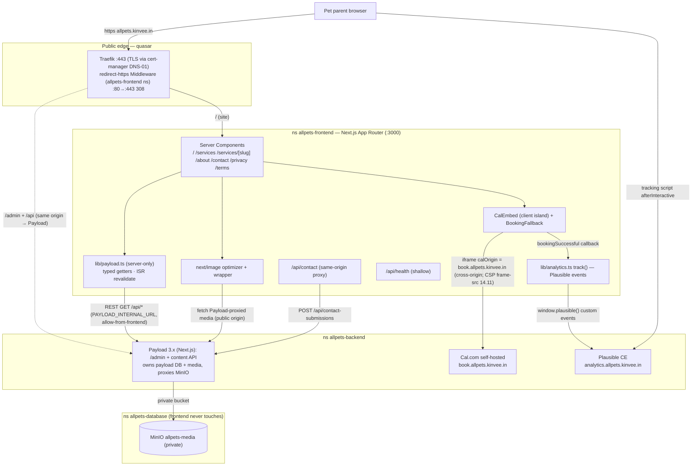

# allpets — Frontend Low-Level Design (LLD)

> **File owner:** 19.3 (the Frontend LLD named in the HLD's §0 and §14). · **Area:** `area:docs` · **Repo:** `allpets-frontend`.
>
> **Status:** Baseline — 2026-06-17. This is the component-level design the marketing-site epics build to: **Epic 7** (site shell), **Epic 8** (public pages), **Epic 9** (booking integration), with the cross-cutting SEO/a11y/perf pass cited at design level from **Epic 12**.
>
> **Relationship to the spine.** This LLD is subordinate to the **System HLD** — [`allpets-backend/planning/architecture.md`](../../allpets-backend/planning/architecture.md) (19.1). The HLD is the conceptual spine (topology, namespaces, NetworkPolicies, DNS/TLS, secrets, CI/CD, co-tenancy). **This document does not re-derive those decisions — it cites them and designs the frontend within their constraints.** Where this doc and an older spec disagree, the HLD's 2026-06-15 owner decisions + cluster verification win.
>
> **Companion docs:** [Backend LLD (19.2)](../../allpets-backend/planning/lld-backend.md) · ingress pattern [`allpets-backend/deploy/k8s/ingress/README.md`](../../allpets-backend/deploy/k8s/ingress/README.md) (3.4) · epic specs [`epic-07`](../../planning/issues/epic-07-marketing-site-shell.md) / [`epic-08`](../../planning/issues/epic-08-public-pages.md) / [`epic-09`](../../planning/issues/epic-09-booking-integration.md).
>
> **Deployed reality this doc is held to (authoritative, from the HLD §1/§3/§6 + 3.4):** single-node k3s on **quasar**; the marketing site runs in namespace **`allpets-frontend`**; **`allpets.kinvee.in` serves the Next.js site AND Payload `/admin` on the same origin** (an HTTP-host fact — the Payload *process* runs in `allpets-backend`, HLD §1); TLS via cert-manager **`letsencrypt-prod` DNS-01** (Route 53); the site's Ingress **+** a per-namespace `redirect-https` Traefik **Middleware** are authored **in this repo** (3.4 fold-in); **Payload 3.x runs on Next.js** (admin + content API in one backend app) and owns marketing content; media lives in **MinIO** bucket `allpets-media` which is **private** — **Payload proxies media**, and the frontend's `next/image` origin points at the **Payload-served** media URL; booking is **Cal.com self-hosted** on `book.allpets.kinvee.in`; analytics is **Plausible CE** on `analytics.allpets.kinvee.in`; secrets are **GitHub repo secrets → k8s Secrets** (`NEXT_PUBLIC_*` are build-time/public, server secrets separate); CI/CD is **GHCR + push over Tailscale**.
>
> **What is NOT used (recorded so a grep finds only disclaimers):** **no Cloudflare** (proxy/Tunnel/Access) — hosts are plain Route 53 A-records → quasar WAN; **no HTTP-01** (solver is DNS-01); **no NodePort** (Traefik Ingress on :80/:443); **no sealed-secrets/SOPS/external-secrets** in phase 1; **no GitOps** (push-based CD); the site **never** opens a Postgres/MinIO connection (no `allpets-frontend → allpets-database` path — HLD §5/§13).

---

## 1. Scope & non-goals

**In scope (this LLD designs):**

- The Next.js **App Router** project structure, route/page model, and rendering strategy for the marketing site (Epics 7/8).
- How pages read content from **Payload** (the SSR data layer, caching/revalidation, the internal-vs-public URL split) — Epic 8 (8.1).
- **`next/image` ↔ MinIO** media serving via the Payload-proxied origin (7.7/7.13).
- The **Cal.com embed/redirect** surface (`/book`, header CTA, service deep link, fallback, analytics events) — Epic 9.
- The **Plausible** tracking script + custom-event emitter (11.3 consumer / 9.7) and its privacy posture.
- **Cross-cutting:** SEO (metadata/sitemap/structured data), a11y, performance budgets (cited from Epic 12 at design level); the component/design-system + styling conventions (7.2/7.3/7.4/7.6); env/config (`NEXT_PUBLIC_*` vs server); and the site's **k8s ingress fold-in** (3.4 template, `allpets-frontend` ns, `redirect-https` Middleware in this repo).

**Non-goals (owned elsewhere, cited not duplicated):**

- Cluster topology, NetworkPolicies, DNS/TLS issuance mechanics, co-tenancy budget — **HLD** (architecture.md §2/§5/§6/§11).
- Payload collection schema, the content API contract, MinIO bucket/key/CORS setup, the rich-text decision — **Epic 5 / Backend LLD** (referenced as a contract).
- Cal.com instance config, event-type naming, OAuth/GCal, instance branding/CSS — **Epic 6**.
- Plausible goal *definitions* and instance — **Epic 11**.
- CSP/`frame-src`/`frame-ancestors`, rate-limiting, honeypot enforcement, CSRF — **Epic 14** (the frontend records the values it needs and coordinates).
- The CI/CD workflow YAML, GHCR pull-secret, secret materialization — **Epic 15 / 14.6** (the frontend ships the manifests they apply).

---

## 2. Tech stack (pinned at design level)

| Concern | Choice | Source |
|---|---|---|
| Framework | **Next.js 15.x App Router + TypeScript** (React 19), `src/` dir, `@/*` alias, `strict: true`, `output: 'standalone'` | 7.1 |
| Styling | **Tailwind CSS v4** (CSS-first `@theme`) — version + config surface recorded in README | 7.2/7.3 |
| Fonts | **Plus Jakarta Sans**, **Sniglet** (display), **Be Vietnam Pro** via `next/font` (self-hosted, `display: swap`) | 7.4 |
| Package manager | **pnpm** (frozen lockfile in CI) | 7.1 |
| Content source | **Payload CMS 3.x** content API (REST), typed via `payload-types.ts` | 8.1 |
| Booking | **Cal.com self-hosted** via `@calcom/embed-react` (`calOrigin` pinned) | 9.1 |
| Analytics | **Plausible CE** script + `window.plausible()` custom events | 9.7 / 11.3 |
| Images | `next/image` optimizer → **Payload-proxied MinIO** origin (AVIF/WebP) | 7.7/7.13 |
| Runtime | `node:22-alpine` (pinned by digest), non-root, standalone server | 7.8 |
| Design source of truth | Stitch **"Playful & Vibrant"** prototype | req §1 |

Each "verify latest stable at 7.1" note in the epics stands — this LLD pins the *shape*, 7.1 pins the exact versions in the README.

---

## 3. App structure (App Router)

### 3.1 Why App Router + why SSR is the default

SSR is a hard requirement (req §8.2 — server-rendered pages for SEO), and App Router gives it by default. The marketing surface is read-mostly, so the dominant pattern is **Server Components fetching from Payload**, with **client components only at interaction islands** (mobile nav drawer, the contact form, the Cal.com embed, the booking fallback). This keeps the JS payload small (perf budget, Epic 12) and the HTML crawlable.

### 3.2 Directory layout (`src/`)

```
src/
├─ app/
│  ├─ layout.tsx              # RootLayout: fonts, globals.css, Header/Footer, <main id="main">   (7.4/7.5)
│  ├─ globals.css             # @import "tailwindcss"; @theme { tokens }                            (7.2/7.3)
│  ├─ page.tsx                # Home "/" — Server Component, composes home/* sections               (8.2–8.6)
│  ├─ loading.tsx             # root Suspense skeleton                                              (8.13, P2)
│  ├─ not-found.tsx           # branded 404 (Server Component, real HTTP 404)                       (8.12)
│  ├─ error.tsx               # branded 500 route boundary ('use client')                           (8.12)
│  ├─ global-error.tsx        # root-layout failure boundary                                        (8.12)
│  ├─ manifest.ts             # web manifest (name/theme/icons)                                     (7.12)
│  ├─ icon.png / apple-icon.png / favicon.ico  # App Router icon file conventions                  (7.12)
│  ├─ robots.ts               # robots policy (allow; sitemap ref)                                  (12.x)
│  ├─ sitemap.ts              # dynamic sitemap from Payload slugs                                  (12.2)
│  ├─ services/
│  │  ├─ page.tsx             # "/services" index — all active services                            (8.7)
│  │  └─ [slug]/page.tsx      # "/services/{slug}" detail + Book-this-service CTA slot             (8.8 → 9.3)
│  ├─ about/page.tsx          # "/about" story + full team grid                                    (8.9)
│  ├─ contact/page.tsx        # "/contact" details + ContactForm (client island)                   (8.10)
│  ├─ privacy/page.tsx        # "/privacy" — Page Lexical body                                      (8.11)
│  ├─ terms/page.tsx          # "/terms" — Page Lexical body                                        (8.11)
│  ├─ book/page.tsx           # "/book" — static shell (SSR) + Cal.com embed (client island)        (9.1/9.5)
│  ├─ styleguide/             # /styleguide primitives demo — noindex, excluded from sitemap        (7.6)
│  └─ api/
│     ├─ health/route.ts      # GET /api/health — shallow {status,gitSha,buildTime}, no-store       (7.11)
│     └─ contact/route.ts     # same-origin proxy → Payload POST /api/contact-submissions           (8.10)
├─ components/
│  ├─ layout/                 # Header, Footer, MobileNav (drawer)                                   (7.5)
│  ├─ ui/                     # Button, Card, SectionHeading, Hero, Container, Badge, Image wrapper  (7.6/7.13)
│  ├─ home/                   # Hero, ServicesGrid, TeamTeaser, Reviews, ClosingCTA                  (8.2–8.6)
│  ├─ services/               # ServiceCard (shared Home↔index)                                     (8.3/8.7)
│  ├─ team/                   # PersonCard (shared Home↔about)                                      (8.4/8.9)
│  ├─ booking/                # CalEmbed, BookServiceCTA, BookingFallback                            (9.1/9.3/9.5)
│  ├─ skeletons/              # CardSkeleton, PersonCardSkeleton, TextSkeleton                        (8.13)
│  └─ RichText.tsx            # shared Lexical renderer (8.8 ↔ 8.9 ↔ 8.11)                           (8.8)
└─ lib/
   ├─ payload.ts              # typed SSR getters (the data layer)                                  (8.1)
   ├─ analytics.ts            # track() — single Plausible emitter                                  (9.7)
   └─ env.ts                  # typed, validated env access (fail-fast)                             (7.9)
```

### 3.3 Route / page model (aligned to epic-08)

| Route | Component | Rendering | Data | Issue |
|---|---|---|---|---|
| `/` | `app/page.tsx` (Server) composing `home/*` | **ISR** (revalidate) | `getSiteSetting`, `getServices`, `getVets`/`getTeamMembers`, `getActivePromotions('Home')`, `getReviews` | 8.2–8.6 |
| `/services` | `app/services/page.tsx` (Server) | **ISR** | `getServices`, `getActivePromotions('Services')` | 8.7 |
| `/services/{slug}` | `app/services/[slug]/page.tsx` (Server) | **SSG + ISR** (`generateStaticParams`) | `getServiceBySlug` → 404 via `notFound()` | 8.8 |
| `/about` | `app/about/page.tsx` (Server) | **ISR** | `getPageBySlug('about')`, `getVets`, `getTeamMembers` | 8.9 |
| `/contact` | `app/contact/page.tsx` (Server) + `ContactForm` (client) | **ISR** details / dynamic form | `getSiteSetting` | 8.10 |
| `/privacy`, `/terms` | `app/{privacy,terms}/page.tsx` (Server) | **ISR** | `getPageBySlug('privacy'\|'terms')` → 404 via `notFound()` | 8.11 |
| `/book` | `app/book/page.tsx` (static shell, Server) + `CalEmbed` (client) | **Static shell**, embed client-only | `getSiteSetting().phone` for fallback (9.5) | 9.1/9.5 |
| `/styleguide` | demo route | static, **noindex**, sitemap-excluded | none | 7.6 |
| `/api/health` | route handler | **dynamic / no-store** | none (shallow) | 7.11 |
| `/api/contact` | route handler | dynamic | proxies to Payload | 8.10 |

Header nav (req §3, built in 7.5): **Home · Services · About · Contact** + primary **Book a Visit** CTA → `/book`. Footer (req §3, populated by 8.6 from `SiteSetting`): quick links, contact block, hours, copyright, privacy/terms, social.

### 3.4 Server vs client components

- **Server (default):** all page files, all `home/*` sections, `ServiceCard`, `PersonCard`, `RichText`, `not-found.tsx`, layout shell. They run server-side, call `lib/payload.ts` directly, and never ship Payload URLs/creds to the browser (8.1 acceptance).
- **Client islands (`'use client'`), kept minimal:**
  - `MobileNav` drawer — focus trap, Esc, `aria-expanded`/`aria-controls` (7.5).
  - `ContactForm` — inline validation, honeypot field, preserve-on-error, `aria-live` toast (8.10).
  - `CalEmbed` + `BookingFallback` — the iframe mount + reachability/timeout fallback (9.1/9.5).
  - `error.tsx` / `global-error.tsx` — App Router requires client error boundaries (8.12).
  - `analytics.ts` `track()` call sites (CTA clicks, embed success callback, form success) (9.7).

### 3.5 Rendering strategy (SSG/ISR for marketing content)

The content is editor-driven but changes infrequently, so the design is **SSG where the param set is known + ISR (time-based revalidation) everywhere**, never per-request SSR for marketing pages:

- **`generateStaticParams()`** on `/services/[slug]` pre-renders the active service slugs at build, with ISR to pick up edits without a redeploy (8.8 notes the 12.8 perf benefit).
- **ISR via Next's `fetch` cache `revalidate`**, set per-collection in `lib/payload.ts` (see §4.2). Editing content in Payload updates the live page after the TTL — "no redeploy to change content" is an explicit acceptance criterion across 8.2/8.6/8.7/8.9.
- The **`/book` shell** is static (title/meta SSR for SEO); the embed itself is a client island that mounts at runtime (9.1). `/api/health` is `force-dynamic` + `no-store` so probes never see a stale 200 (7.11).
- **Failure mode:** a Payload outage must degrade gracefully — a getter throws into the segment error boundary (8.12) or returns a typed empty/fallback so the shell still renders (8.1, req §8.6). Reviews specifically tolerate empty (Epic 10 owns last-cached fallback).

---

## 4. Data fetching from Payload

### 4.1 The same-origin / two-URL model

`allpets.kinvee.in` serves **both** the Next.js site and Payload `/admin` (+ `/api`) on the **same origin** (HLD §1/§3, 3.4 host map). That is an HTTP-host fact for the browser; the Payload **process runs in `allpets-backend`** and is the only client of the `payload` DB + MinIO (HLD §1/§5/§12.7). The frontend therefore has **two** Payload URLs, by design (7.9 / 8.1):

| Var | Value | Used by | Why |
|---|---|---|---|
| `PAYLOAD_INTERNAL_URL` (server-only) | `http://payload.allpets-backend.svc.cluster.local:80` (in-cluster Service) | **SSR getters** in `lib/payload.ts` | Faster, avoids the public edge + CORS; rides the deployed `allow-from-frontend` NetworkPolicy (frontend → backend, HLD §5). **Never** shipped to the client. |
| `NEXT_PUBLIC_PAYLOAD_URL` (build/public) | `https://allpets.kinvee.in` | client-side / media URL needs only | The public origin for the rare client call and for media URL construction. |

This split is the contract 7.9 defines and 8.1 consumes. The site **never** queries Postgres/MinIO directly — it reads marketing content **through Payload's content API** over the frontend→backend path (HLD §5/§12.7); a data-tier path from `allpets-frontend` is neither deployed nor needed (HLD §13).

### 4.2 The SSR data layer (`lib/payload.ts`, 8.1)

One typed, cacheable, server-only module exposes per-collection getters so pages never scatter raw `fetch`:

```ts
// server-only; never imported into a client component
getSiteSetting()                 // SiteSetting global (5.3)
getServices()                    // active, sorted displayOrder (5.4)
getServiceBySlug(slug)           // one service or null → notFound() (5.4)
getVets() / getTeamMembers()     // active, sorted displayOrder (5.5/5.6)
getActivePromotions(placement)   // date-window + placement filtered (5.7)
getPageBySlug(slug)              // about | privacy | terms (5.8)
getReviews()                     // Epic-10 surface; empty-tolerant (10.6/10.7)
```

- **API choice:** Payload **REST** (`GET /api/{collection}?where[active][equals]=true&sort=displayOrder&depth=1`), standardized across getters. `depth` is set high enough to populate `heroImage`/`photo` upload relations and `Vet.servicesPerformed` in one call (8.1).
- **Types:** import the generated `payload-types.ts` (from 5.1 `payload generate:types`) so getters return real types, not `any`. If the frontend repo can't import from the backend directly, the types are vendored as a typed contract (seam flagged for 5.19) — getters still return typed shapes (8.1 acceptance).
- **Caching / revalidation (req §8.3, implements ISR):** Next `fetch` cache with per-getter `revalidate` TTLs, documented at the getter:
  - Services / SiteSetting ≈ **5 min**
  - Promotions ≈ **1 min** (date-windowed, time-sensitive)
  - Pages (about/privacy/terms) ≈ 5 min
  - Reviews per Epic-10's cadence (render-only here)
  Time-based revalidation is the baseline; tag-based revalidation is a future option if Payload emits webhooks (not phase-1 required). TTLs are the 8.13/12.8 perf baseline.
- **Filtering server-side:** `active` flags and date windows are filtered in the query so pages don't re-implement that logic (8.1).
- **Failure mode:** getters either throw into the page's error boundary (8.12) or return a typed empty/fallback so the shell renders (req §8.6). A simulated Payload outage must degrade gracefully, not white-screen (8.1 acceptance).

### 4.3 Contact-form write path (8.10)

The contact form is the one **write**. To avoid the browser calling Payload cross-origin with creds (and to keep CSRF simple), the design routes through a **same-origin Next route handler proxy**: client `POST /api/contact` → server handler → Payload `POST /api/contact-submissions` (the public-create path, 5.9). Honeypot field is wired here; server-side honeypot/rate-limit enforcement is 14.2/14.3; CSRF is 14.4 (coordinated, not re-implemented). `contact-submitted` fires via the shared `track()` only on a 2xx (9.7).

---

## 5. Media — `next/image` ↔ MinIO (private bucket, Payload-proxied)

### 5.1 The private-bucket serving decision

MinIO bucket **`allpets-media` is private** (HLD §3 components table, 12.7). The frontend does **not** hit MinIO directly and does **not** hold MinIO keys — that bucket is reachable only from `allpets-backend` (HLD §5). Instead, **Payload proxies media**: uploads are served through Payload's media route on the public origin, and `next/image`'s remote origin points at that **Payload-served** URL (HLD §3: "Bucket `allpets-media` is private (Payload proxies media)"). The frontend optimizer fetches the already-proxied image; it never needs a scoped MinIO key or `forcePathStyle` — those are Payload's concern (Backend LLD / 5.10).

> **Origin source of truth:** the exact public media origin is settled by **5.10** and must match dev/prod `NEXT_PUBLIC_*` (7.7/7.9). The design assumes the Payload-served media path under the public origin (e.g. `https://allpets.kinvee.in/api/media/...` or a dedicated `media.allpets.kinvee.in` if 5.10 elects one) — the frontend reads it from env, never hard-codes it (7.7 acceptance).

### 5.2 `next.config.ts` — `remotePatterns` + loader (7.7)

```ts
// next.config.ts (shape; hostname driven from env where possible)
images: {
  remotePatterns: [
    // prod: the Payload-served media origin from 5.10/7.9
    { protocol: 'https', hostname: '<prod-media-host>', pathname: '/**' },
    // dev: local MinIO/Payload from the 7.10 compose
    { protocol: 'http', hostname: 'localhost', port: '<dev-port>', pathname: '/**' },
  ],
  formats: ['image/avif', 'image/webp'],          // 7.13, req §8.3
  deviceSizes: [360, 768, 1280, 1920],            // project breakpoints, req §8.8 (no unused variants → 2.12 CPU)
  imageSizes: [/* tuned to card/icon sizes */],
}
```

- **Loader decision (7.7):** default to **Next's built-in optimizer** fetching + optimizing the Payload-served image, *unless* quasar CPU pressure (the 2.12 co-tenant budget) says otherwise — in which case fall back to pre-sized variants from Payload/MinIO with an `unoptimized`/custom loader. The choice is recorded for 7.13, and CPU impact is checked against 2.12.
- **SVG:** prefer inline-component or non-SVG icons; `dangerouslyAllowSVG` is avoided unless service icons demand it, and any CSP implication is coordinated with 14.1/14.11 (7.7).
- Must work in **both** dev (local MinIO from the 7.10 compose) and prod (the 5.10 origin) — both patterns present (7.7 acceptance).

### 5.3 The shared `<Image>` wrapper (7.13)

`components/ui/Image.tsx` wraps `next/image` and is the only image path the `Card`/`Hero` slots consume (no raw ``):

- **Requires `alt`** (a11y, req §8.1) — enforced by the prop type.
- Enforces a sensible default `sizes`; `loading="lazy"` by default, `priority` exposed for above-the-fold use.
- **LCP:** the Home hero (8.2) passes `priority` (it is the mobile LCP element, req §8.3) — preloaded, not lazy.
- **CLS:** always `width`/`height` or `fill` + positioned container so space is reserved (req §8.3, CLS < 0.1) — paired with 8.13 skeletons (12.8 lever).
- **Blur:** static imports get `blurDataURL` free; for remote Payload-served uploads, decide generate-vs-skip (7.13) — default skip blur for remote rather than pay generation cost.

---

## 6. Booking — Cal.com embed (Epic 9)

### 6.1 Surfaces

| Surface | What | Issue |
|---|---|---|
| Header CTA | primary "Book a Visit" `<Link href="/book">` on every page, desktop + mobile; fires `booking-started` | 9.2 |
| `/book` | full-page Cal.com embed (client island) against the self-hosted origin | 9.1 |
| Service detail CTA | "Book this service" → vet picker → per-vet×service deep link | 9.3 |
| Theming | embed-side `uiConfig` matched to 7.3 tokens / 7.4 fonts | 9.4 |
| Fallback | client-side reachability/timeout → "Booking temporarily unavailable — call (phone)" | 9.5 |
| Events | `booking-started` / `booking-completed` via the single emitter | 9.7 |

### 6.2 Embed mechanics (the load-bearing settings)

- Use **`@calcom/embed-react`**: `import Cal, { getCalApi } from "@calcom/embed-react"`. The embed **must** pin **`calOrigin: "https://book.allpets.kinvee.in"`** (from `NEXT_PUBLIC_CALCOM_URL`, 7.9) so it never phones home to `app.cal.com` — verified by checking network calls hit `book.allpets.kinvee.in` (9.1 acceptance). Confirm the exact prop name against the installed version; the self-host origin override is the critical setting.
- All "Book a Visit" entry points route to the **internal `/book` route**, not a raw Cal.com URL — this keeps theming, fallback, and analytics under our control (9.2).
- **Deep link (9.3):** a self-hosted booking page is `https://book.allpets.kinvee.in/<calcomUsername>/<eventTypeSlug>`; as an embed it's the **`calLink`** value `"<calcomUsername>/<eventTypeSlug>"` with `calOrigin` unchanged. Multi-vet reality: a `Service` has many `Vet`s and **phase 1 has no "any vet"** (req §4.5.3), so the detail page renders a **vet picker** (the vets whose `servicesPerformed` includes this service), each option deep-linking to that vet's event type — preferred option (a). The slug shape mirrors the **6.11** convention; dead links are guarded (build-time **6.16**; runtime: hide unresolved options, never 404).
- **Single embed mount path:** the deep link reuses the 9.1 embed component (route to `/book` with params, or mount inline) — one mount, not two.

### 6.3 Theming (9.4)

Embed-side only: `cal("ui", { theme: "light", cssVarsPerTheme: { light: { "cal-brand": "<7.3 token>" } }, layout: "month_view", ... })`, pulling brand color/radii from the **7.3 token source** (single source of truth, not duplicated hex). Typography matched to 7.4 fonts **only as far as Cal.com allows** (req §4.5). Anything the embed API can't reach is **instance-side custom CSS → 6.14**, with the handed-off knobs recorded. Keep light theme; verify WCAG AA contrast inside the embed or log the gap to 12.10.

### 6.4 Reachability fallback (9.5)

The embed mount is wrapped in an **error boundary + load timeout**. On failure (down/network/blocked) the design replaces **only the embed region** with `BookingFallback`: "Booking is temporarily unavailable — please call **(clinic phone)**", where the phone is read from `SiteSetting.phone` (5.3) via the 8.1 SSR layer, rendered as a `tel:` link, with a "Try again" re-mount. Header/footer/page content still render (no full-page crash). This is **distinct** from `/api/health` (7.11, the frontend's own server) and from Cal.com's server-side health (6.3) — it is the client-side iframe safety net. `booking-completed` must **not** fire on the fallback path.

### 6.5 Cookie / host notes

Cal.com keeps its **own dedicated host** `book.allpets.kinvee.in` (never a path under `allpets`) precisely because it needs a stable host for **session cookies and Google OAuth callbacks** (HLD §1/§12.5, req §9). The embed is a **cross-origin iframe**, so the single biggest hazard is **CSP**: a wrong `frame-src` (our side) / `frame-ancestors` (Cal.com side) pair silently blanks the iframe. The frontend records the required **`frame-src https://book.allpets.kinvee.in`** on **14.11** (which owns CSP) — coordination, not hand-rolled here (9.1 acceptance).

---

## 7. Analytics — Plausible (privacy-respecting)

- **Script:** the Plausible tracking script is loaded from the self-hosted instance **`analytics.allpets.kinvee.in`** (HLD §1), with `data-domain="allpets.kinvee.in"`. Both the domain and script host come from env — `NEXT_PUBLIC_PLAUSIBLE_DOMAIN` and `NEXT_PUBLIC_PLAUSIBLE_SCRIPT_URL` (7.9). The script is added in **11.3**; this LLD designs the consumer side. Prefer `next/script` with `strategy="afterInteractive"` so it never blocks the LCP.
- **Privacy posture:** Plausible CE is **cookieless and collects no PII** (HLD §1/§3). Combined with **self-hosting** (no third-party tracker domain) and `next/font` self-hosting fonts (no `fonts.googleapis.com` runtime hit, 7.4), the marketing site makes **no third-party tracker request** at runtime (req §8.5). No consent banner is required for cookieless first-party analytics in phase 1; the privacy page (8.11, authored 17.9) still discloses Plausible.
- **Custom events (the single emitter, 9.7):** `lib/analytics.ts` exposes one `track(event, props?)` that guards `typeof window !== 'undefined' && window.plausible` and no-ops safely (script absent in dev / blocked). Call sites:
  - `booking-started` — header CTA (9.2) and service deep link (9.3, with a `service` prop).
  - `booking-completed` — fired from the **Cal.com embed success callback** (`cal("on", { action: "bookingSuccessful"... })`), never a timer (9.7).
  - `contact-submitted` — on a successful (2xx) contact submit (8.10).
  Event names match the **11.4** goal names **character-for-character**; props are **PII-free** (a `service` slug is fine, never a name/email — req §8.4). Goals are defined in 11.4 and verified in 16.5.

---

## 8. Cross-cutting concerns

### 8.1 SEO (Epic 12, design level)

- **Metadata:** App Router `metadata`/`generateMetadata` per route. Service detail and legal pages drive `<title>`/description from the record (service name/short description; the Page `seo` group `metaTitle`/`metaDescription`, surfaced by 8.11 so 12.1 doesn't re-fetch). Per-page meta is 12.1; the LLD's job is to keep the fields reachable.
- **Sitemap:** `app/sitemap.ts` generated dynamically from active Payload slugs (services, pages) + static routes; `/styleguide` and `/api/*` excluded (12.2). `app/robots.ts` references it.
- **Structured data:** `schema.org/VeterinaryCare` (org/NAP) and the Google-reviews **aggregate rating** (fed from 8.5's rating value) are emitted as JSON-LD — owned by **12.4**; the LLD keeps the rating value reachable from the reviews component.
- **SSR/SSG correctness:** all marketing pages are server-rendered (req §8.2); the 404 returns a **real HTTP 404** (`not-found.tsx`, no soft-404) for SEO correctness (8.12); headline/hero text stays **real DOM text**, never baked into an image (8.2).
- **Icons/manifest:** favicon, apple-touch (180), maskable 192/512, `manifest.webmanifest` with `theme_color` from the 7.3 palette (7.12). OG/social share image is the separate 12.5 concern.

### 8.2 Accessibility (req §8.1 — hard requirement)

- Semantic landmarks: `<header>`, `<nav aria-label="Primary">`, `<main id="main">`, `<footer>`; a **skip-to-content** link is the first focusable element targeting `#main` (7.5).
- **Mobile nav** is a real keyboard-accessible drawer: focus trap, Esc to close, `aria-expanded`/`aria-controls` on the toggle (7.5).
- `SectionHeading` takes a heading `level` prop (no hard-coded `<h2>`) so document heading order stays valid (7.6). `RichText` emits real `<h2>`/`<h3>` (8.11).
- Every image has meaningful `alt` (enforced by the `<Image>` wrapper, 7.13). Star ratings are screen-reader-readable (`aria-label="Rated 5 out of 5"`, not glyph-only — 8.5).
- Contact form: labels associated with inputs, errors via `aria-describedby`, visible focus, `aria-live` success toast (8.10).
- Visible focus states on all interactive primitives; the `/styleguide` route must be **axe-clean** (7.6). WCAG AA contrast is verified for tokens (12.10) and inside the Cal.com embed (9.4).
- Shimmer/skeleton animation respects `prefers-reduced-motion` (8.13).

### 8.3 Performance budgets (Epic 12, design level)

- **Core Web Vitals targets** (req §8.3): LCP, CLS < 0.1, good INP — the final Lighthouse/CWV pass is **12.8**; this LLD bakes in the levers:
  - **LCP:** hero image `priority` (8.2/7.13); `output: 'standalone'` slim runner (7.1); `next/font` self-hosted with `display: swap` (no FOUT/CLS, 7.4); Plausible script `afterInteractive` (§7).
  - **CLS:** explicit image dimensions / `fill` + reserved space (7.13); `loading.tsx` skeletons matching real dimensions (8.13).
  - **Payload:** AVIF/WebP + breakpoint-tuned `deviceSizes` so no oversized image ships to mobile (7.13); per-collection ISR TTLs cache content (§4.2).
- **Server-side CPU budget (2.12 co-tenancy):** the Next optimizer's per-image CPU is checked against the `allpets-frontend` quota (HLD §11: req 0.5 cpu / 1Gi, limit 2 cpu / 2Gi); the pre-sized-in-MinIO fallback is the relief lever (7.7/7.13). Single replica unless node headroom allows more (7.8/2.12).

### 8.4 Component / design-system + styling conventions

- **Tokens (7.3):** the Stitch "Playful & Vibrant" palette, type ramp, radii, shadows, spacing become named **Tailwind v4 `@theme` tokens** with **semantic aliases** (`brand-primary`, `surface`, `text-muted`) so a re-skin changes one mapping, not 200 usages. **No dark mode in phase 1** unless the prototype defines one (recorded decision). Fonts wired by CSS variable (`--font-jakarta`/`--font-sniglet`/`--font-bevietnam`) referenced by tokens; loaded by 7.4.
- **Primitives (7.6):** `Button` (primary/secondary/ghost × sm/md/lg, renders as `<Link>` for nav CTAs), `Card` (Service + Team variants), `SectionHeading` (level-prop), `Hero`, plus `Container`/`Badge`/`Icon`. Image slots consume the 7.13 `<Image>` wrapper, never raw ``. A documented variant convention (CVA or prop→class maps); no heavyweight component library (the prototype is bespoke). The `/styleguide` route showcases every variant (noindex).
- **Shared components named once (no drift, epic-08 review):** `ServiceCard` (8.3 ↔ 8.7), `PersonCard` (8.4 ↔ 8.9), `RichText` (8.8 ↔ 8.9 ↔ 8.11) — each defined in exactly one issue, reused by the others.
- **Tailwind footgun:** use full literal class names (no dynamically-composed class strings) so the production build doesn't purge them (7.2).
- **Responsive:** every layout correct at **360 / 768 / 1280 / 1920** (req §8.8) — drawer below `md`, inline nav above (7.5).

### 8.5 Env / config (`NEXT_PUBLIC_*` vs server)

Typed, validated access via `lib/env.ts` — fail-fast on a missing required var so a misconfigured deploy fails loudly (7.9). The split is the contract 7.8/8.1/9.1/9.7 consume:

| Var | Class | Value | Consumer |
|---|---|---|---|
| `NEXT_PUBLIC_PAYLOAD_URL` | public, build-inlined | `https://allpets.kinvee.in` | client / media URLs (7.9/8.1) |
| `PAYLOAD_INTERNAL_URL` | **server-only runtime** | `http://payload.allpets-backend.svc.cluster.local:80` | SSR getters (8.1) |
| `NEXT_PUBLIC_CALCOM_URL` | public, build-inlined | `https://book.allpets.kinvee.in` | embed `calOrigin` (9.1/9.3) |
| `NEXT_PUBLIC_PLAUSIBLE_DOMAIN` | public, build-inlined | `allpets.kinvee.in` | tracking script (11.3) |
| `NEXT_PUBLIC_PLAUSIBLE_SCRIPT_URL` | public, build-inlined | `https://analytics.allpets.kinvee.in/js/...` | tracking script (11.3) |
| `GIT_SHA` / `BUILD_TIME` | server runtime | build args | `/api/health` (7.11) |

- **`NEXT_PUBLIC_*` are inlined at build time** → they are **repo variables, NOT secrets** (none of the three sibling origins is secret), passed as `--build-arg` in CI (15.3) and `ARG`/`ENV` in the Dockerfile **before** `pnpm build` (7.8). **Changing a `NEXT_PUBLIC_*` requires a rebuild, not just a redeploy** — pinned because it's a frequent self-host footgun (7.9, epic-07 review).
- **Server secrets are separate** (HLD §8): no secret values are introduced by these public vars; any runtime secret comes from a k8s Secret materialized by 14.6 (the GitHub-secrets→k8s-Secret pipeline, not yet built — operator creates out-of-band today, HLD §8). No `.env` baked into the image.

### 8.6 Containerization (7.8, citing HLD §9)

Multi-stage `node:22-alpine` (pinned **by digest**, 14.8) — `deps` → `builder` (`pnpm build`, `output: 'standalone'`) → `runner` (non-root UID, copies `.next/standalone` + `.next/static` + `public/`, `CMD ["node","server.js"]`, `EXPOSE 3000`). Image is the immutable **`:sha`** tag at deploy — **no `:latest`** in committed YAML (the Rev-3/15.9 3-way-merge blocker). CI/CD is **GHCR + push over Tailscale** mirroring local-ai-proxy (HLD §9); the workflow YAML is 15.3, GHCR pull-secret 15.6 — this repo ships the Dockerfile + manifests they consume.

---

## 9. The k8s ingress fold-in (3.4 template, this repo)

Per 3.4 and the reproducibility decision (HLD §9), **the `allpets.kinvee.in` Ingress + its `redirect-https` Middleware are authored in this repo** (allpets-frontend owns the `allpets-frontend` namespace). Manifests live under `deploy/k8s/` as a kustomize tree applied by `kubectl apply -k deploy/k8s`.

**Deployment/Service (7.8):**
- `Deployment frontend` — container `frontend`, **1 replica** (raise only with node headroom, 2.12), `RollingUpdate maxUnavailable:0 / maxSurge:1`, containerPort **3000**, liveness/readiness → **`/api/health`** (7.11), `imagePullSecrets` → GHCR secret (15.6), **resource requests/limits within the `allpets-frontend` quota** (HLD §11), `:sha` image (no `:latest`).
- `Service frontend` — `:80` → targetPort `3000`.

**Ingress + Middleware (folds in the 3.4 canonical shape — host map row `allpets.kinvee.in` / ns `allpets-frontend` / Service Next.js :3000 / TLS secret `allpets-kinvee-in-tls`):**

```yaml
# deploy/k8s/ingress.yaml — allpets-frontend
apiVersion: networking.k8s.io/v1
kind: Ingress
metadata:
  name: frontend-ingress
  namespace: allpets-frontend
  labels:
    app.kubernetes.io/part-of: allpets
    allpets.kinvee.in/tier: frontend
  annotations:
    cert-manager.io/cluster-issuer: letsencrypt-prod          # DNS-01 (HLD §6) — NOT HTTP-01
    traefik.ingress.kubernetes.io/router.middlewares: allpets-frontend-redirect-https@kubernetescrd
spec:
  ingressClassName: traefik
  tls:
    - hosts: [allpets.kinvee.in]
      secretName: allpets-kinvee-in-tls
  rules:
    - host: allpets.kinvee.in
      http:
        paths:
          - path: /                                            # whole host at / — app-auth-only (3.6)
            pathType: Prefix
            backend:
              service:
                name: frontend
                port: { number: 3000 }
```

```yaml
# deploy/k8s/redirect-middleware.yaml — allpets-frontend's OWN copy
apiVersion: traefik.io/v1alpha1
kind: Middleware
metadata:
  name: redirect-https
  namespace: allpets-frontend
spec:
  redirectScheme:
    scheme: https
    permanent: true                                            # 308
```

Non-negotiables this fold-in honors (3.4):
- **`ingressClassName: traefik`**; cert-manager annotation `letsencrypt-prod`; `tls.secretName` exactly `allpets-kinvee-in-tls` (dots→dashes); cert written into **this namespace** by cert-manager.
- The **`redirect-https` Middleware lives in `allpets-frontend`** (its own copy — `allowCrossNamespace` is OFF, a Middleware is only referenceable from its own namespace); the annotation prefix is `allpets-frontend-` + `@kubernetescrd`. **Do not** add the global Traefik redirect arg (it would change behavior for every co-tenant including aarogya healthcare prod). **Middleware applies before the Ingress** in the kustomization.
- **Single `/` rule, app-auth-only (3.6):** Payload serves **`/admin`** and its content API on the **same origin** behind the Next.js site — **no second `/admin` path rule, no auth middleware** at ingress. The same-host routing is coordinated with **5.13/3.4/3.6** so the frontend Ingress and Payload don't collide.
  - **`/api/*` is a SHARED namespace and must be split explicitly (5.13 — the one genuinely-unresolved seam, also §11):** the Next.js app owns **`/api/health`** (7.11) and **`/api/contact`** (the 8.10 proxy); Payload owns **`/api/{collection}`**, **`/api/media`**, and **`/api/contact-submissions`** (5.9), plus **`/admin`**. Since the single `/` rule sends the whole host to the Next.js Service (:3000), the load-bearing obligation is that **the Next.js app reverse-proxies the Payload-owned paths (`/admin`, `/api/{collection}`, `/api/media`, …) through to the Payload Service in `allpets-backend`** while keeping its own `/api/health` + `/api/contact` local. The alternative — a second path-scoped Ingress targeting the Payload Service — is **rejected** (cross-namespace target + extra ingress surface, against 3.6). **5.13 must commit the exact `/api` path split + the Next rewrite/proxy rules before either app is applied.**
- Backend port **3000** matches the committed NetworkPolicy contract (HLD §5 `allow-traefik-ingress` frontend). The site reaches Payload over the `allow-from-frontend` path; it has **no data-tier path** (HLD §5/§13).
- Cert verification (3.5) is per-host and **DNS-01** — there is no HTTP ACME challenge, so the 308 redirect is safe (HLD §6, 3.4).

---

## 10. Page → data → service flow (Mermaid)



> Solid arrows are the live request/data path. The Next.js site (ns `allpets-frontend`) reads content **only via Payload's content API** over the `allow-from-frontend` path and **never** opens a Postgres/MinIO connection (HLD §5/§12.7). Media is **Payload-proxied** from the private `allpets-media` bucket; `next/image` fetches the proxied URL. The Cal.com embed is a **cross-origin iframe** to `book.allpets.kinvee.in` (CSP `frame-src` owned by 14.11). `/admin` rides the **same origin** as the site but is the Payload process in `allpets-backend`.

---

## 11. Open design seams (coordination, not blockers)

- **Media origin (5.10 ↔ 7.7/7.9):** the exact Payload-served media host/path is settled by 5.10; `remotePatterns` + `NEXT_PUBLIC_*` must match it dev and prod.
- **Same-host `/admin` routing (5.13 ↔ 3.4/3.6 ↔ 7.8):** the site and Payload both live on `allpets.kinvee.in`; the same-origin path split for `/admin` + `/api` is reconciled with 5.13 (single `/` rule, app-auth-only).
- **CSP `frame-src` (9.1 ↔ 14.11):** the booking iframe needs `frame-src https://book.allpets.kinvee.in`; 14.11 owns CSP/`frame-ancestors`.
- **Type contract (8.1 ↔ 5.1/5.19):** generated `payload-types.ts` import vs vendored copy; the 5.19 sign-off gates page work.
- **Event-name parity (9.7 ↔ 11.4):** custom-event names must match goal names exactly.
- **Cal.com theming knobs (9.4 ↔ 6.14):** which styling is embed-side vs instance-side custom CSS.
- **Reviews contract (8.5 ↔ 10.6/10.7):** shape + fallback of the Epic-10 reviews surface.

---

## 12. References

- **System HLD (the spine, cited throughout):** [`allpets-backend/planning/architecture.md`](../../allpets-backend/planning/architecture.md) — §1 (hosts, same-origin `/admin`, Payload in `allpets-backend`), §2 (topology diagram), §3 (components: site, Payload, MinIO private/proxied), §5 (NetworkPolicies: `allow-from-frontend`, no frontend→database), §6 (DNS/TLS DNS-01), §8 (secrets), §9 (CI/CD push over Tailscale), §11 (2.12 co-tenant budget), §12.3/§12.4/§12.5/§12.7 (ADRs), §13 (non-uses).
- **Ingress pattern (3.4):** [`allpets-backend/deploy/k8s/ingress/README.md`](../../allpets-backend/deploy/k8s/ingress/README.md) — host map, redirect Middleware, app-auth-only, frontend fold-in.
- **Epic 7 — site shell:** [`planning/issues/epic-07-marketing-site-shell.md`](../../planning/issues/epic-07-marketing-site-shell.md) (7.1–7.13).
- **Epic 8 — public pages:** [`planning/issues/epic-08-public-pages.md`](../../planning/issues/epic-08-public-pages.md) (8.1–8.13).
- **Epic 9 — booking integration:** [`planning/issues/epic-09-booking-integration.md`](../../planning/issues/epic-09-booking-integration.md) (9.1–9.7).
- **Backend LLD (19.2, companion):** [`allpets-backend/planning/lld-backend.md`](../../allpets-backend/planning/lld-backend.md).
- **Cited at design level (not built here):** Epic 5 (Payload schema/CORS/media), Epic 6 (Cal.com config/branding), Epic 11 (Plausible script/goals), Epic 12 (SEO/a11y/perf pass), Epic 14 (CSP/rate-limit/CSRF), Epic 15 / 14.6 (CI/CD + secret materialization).
